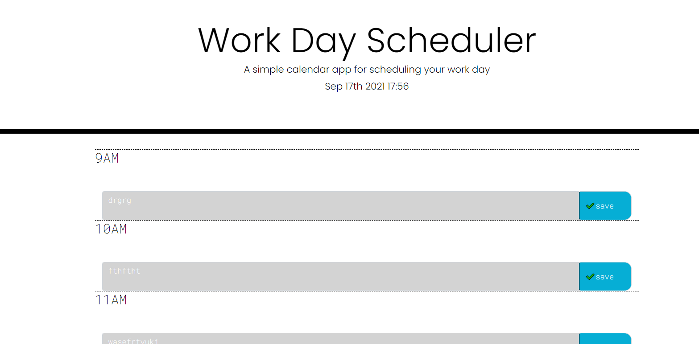

# H5-Calendar
## Description
This is an web application anyone can use to plan their work day 9 - 5. The current hour is highlighted red, past hours are grey, and the future is green. Organization is imperative for any working professional and/or student so having something like this makes it easy to track what needs to be done when. I learned a lot about JQuery when doing this assignment as well as Bootstrap. I also learned a lot about for loops.
## Usage
Provide instructions and examples for use. Include screenshots as needed.
To add a screenshot, create an `assets/images` folder in your repository and upload your screenshot to it. Then, using the relative filepath, add it to your README using the following syntax:
- https://github.com/mollymoo002/H5-Calendar
- https://mollymoo002.github.io/H5-Calendar/
   
## Credits
- Ask BCS has been a huge help in this project
- The tutoring team
- My instructor and TA
- https://www.w3schools.com/
- https://css-tricks.com/
- https://developer.mozilla.org/en-US/
- https://getbootstrap.com/docs/5.1/getting-started/introduction/

